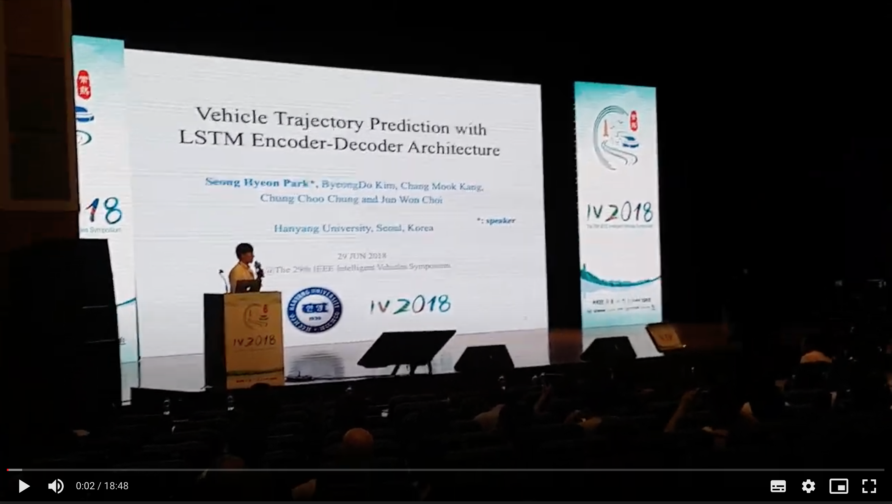

I had an oral session at the IEEE Intelligent Vehicles Symposium (IV) 2018, where my recent paper **[Sequence-to-Sequence Prediction of Vehicle Trajectory via LSTM Encoder-Decoder Architecture](https://shpark.org/publication/1802.06338/)** has ben presented.

It was such a great pleasure for me to experience making a speech in front of hundreds of people hearing it.